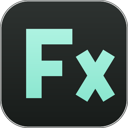

<div align="center">



# FFX Compatibility Tool

**The .ffx preset converter for every After Effects version.**

Converts After Effects **.ffx** presets for cross-version compatibility,
strips effects whose plugins you don't own, and shows you exactly what is
inside a preset — all offline, in one portable exe. Built for
**.NET Framework 4.8 / WPF**: runs on Windows 7 SP1 through Windows 11,
no installer, no runtime download on Windows 10/11.

[](https://github.com/marbou92/FFX-Compatibility-Tool/actions/workflows/test.yml)
[](https://github.com/marbou92/FFX-Compatibility-Tool/actions/workflows/nightly.yml)
[](https://github.com/marbou92/FFX-Compatibility-Tool/actions/workflows/build.yml)
[](https://github.com/marbou92/FFX-Compatibility-Tool/releases/latest)
[](LICENSE)
[](packaging/winget)

[Download](https://github.com/marbou92/FFX-Compatibility-Tool/releases/latest) · [Nightly](https://github.com/marbou92/FFX-Compatibility-Tool/releases/tag/nightly) · [Report an issue](https://github.com/marbou92/FFX-Compatibility-Tool/issues)

</div>

---

## ✨ Works with every AE version

| Target | What the converter does |
| --- | --- |
| **CS5.5** | Verified full downgrade to CS5.5's native format — the only target checked against a real natively-saved sample. The result opens in every later AE too. |
| **CS6 · CC 2013 · CC 2014 · CC 2015 · CC 2015.3 · CC 2017 · CC 2018 · CC 2019 · 2020 · 2021 · 2022 · 2023 · 2024 · 2025** | Native-format conversion — effects you don't own are removed and indexes repaired while the preset stays in the era the source wrote it, byte for byte. No version bytes are invented or guessed. |

The format research the engine is built on lives in
[RESEARCH_NOTES.md](RESEARCH_NOTES.md).

## 📥 Install

1. Grab the **FFXCompatibilityTool-\*.exe** from the
   [latest release](https://github.com/marbou92/FFX-Compatibility-Tool/releases/latest)
   — that single file is the whole app.
2. Run it. Everything lives inside the exe — no installer, no zip, no
   DLL pile, no data folder.
3. Windows 7 only: install the .NET 4.8 runtime once —
   [download](https://dotnet.microsoft.com/download/dotnet-framework/net48).

> ⚠️ Windows warns *"publisher could not be verified"* on first run — the app
> is unsigned open source, and Windows says that about every fresh download.
> Check the SHA-256 on the release page, click **Run**, and if the prompt
> gets old: right-click the exe → Properties → **Unblock**.

### winget

The app is packaged for the
[Windows Package Manager](https://learn.microsoft.com/windows/package-manager/winget/):

```powershell
winget install --id Marbou92.FFXCompatibilityTool
```

The manifest set lives in [packaging/winget](packaging/winget) and lands in
the community catalog at `microsoft/winget-pkgs` through a pull request —
until that listing is live, the download above is the way to go.

> 🌙 Want new features early? The rolling
> [nightly](https://github.com/marbou92/FFX-Compatibility-Tool/releases/tag/nightly)
> pre-release is rebuilt from every push to main.

## 🎬 Convert

- Drop presets — or a whole folder — anywhere on the window, or browse.
- Pick the target AE version: **CS5.5** for the verified full downgrade, or
  the exact version you're bringing presets to for native-format conversion.
- A folder opens as a file manager with the source subfolder layout; every
  row fills in with its live conversion status. Presets referencing plugins
  you don't own get a warning badge — double-click a preset to toggle its
  effects yourself.
- The **expand button** (top of the file manager) opens it across the whole
  page — Esc or the button puts it back.
- Five output modes: a `converted` subfolder, a version suffix beside the
  originals, overwrite, or one ZIP / one folder that mirrors the subfolders.
  Every run is a clean rebuild and writes a `conversion-report.csv`.

## 🔍 Effect Lister

- Open a preset to read it the way AE's Effect Controls panel draws it:
  parameter groups, popups, sliders, color swatches, stopwatch states,
  keyframe navigators — plus a compatibility list of what's missing on this
  machine.
- Open a folder to browse the same tree: click a folder and hand exactly
  that subfolder to Convert, or ctrl/shift-click presets and hand over a
  selection.
- **Folder report** deep-reads every preset into one table, exportable as CSV.

## ⚙️ Settings

- **Plugin profile** — which plugin suites you own, so compatibility
  warnings match your machine.
- **Theme** — four color palettes in light and dark, or **Follow the
  Windows theme** to track the system setting and switch live.
- **Verbose Logging** — per-file conversion steps in the session log; turn
  on when reporting a bug.
- **Storage cleanup** and **Check for Updates** — the only network call the
  app ever makes, and when it finds a new version the link opens straight
  to that release's page.

## 🆘 Problems?

If the app crashes it shows a readable report and saves the full trace to
`%LOCALAPPDATA%\FFXCompatibilityTool\crash.log`. **Report on GitHub** in
that dialog opens a prefilled issue with the trace on your clipboard — or
open one yourself at the
[issue tracker](https://github.com/marbou92/FFX-Compatibility-Tool/issues).
For conversion bugs, turn on **Verbose Logging** in Settings first — the
session log then carries every per-file step. No telemetry, no crash
uploads: nothing leaves your machine unless you send it yourself.

## 🛠️ Build from source

```
dotnet restore FfxTool.sln
dotnet test FfxTool.sln --configuration Release
dotnet build FfxTool.sln --configuration Release
# → FfxTool.Gui\bin\Release\net48\FFXCompatibilityTool.exe — one file
#   (the DLLs and seed tables are merged/embedded into it; Debug stays
#   unpacked)
```

CI runs on every push: **CI** (test.yml), **Nightly** (nightly.yml — the
rolling pre-release), **Release** (build.yml — push a `v*` tag, or use its
Run workflow page with a version number to publish exactly that version).

## ⚖️ License

MIT — see [LICENSE](LICENSE). Adobe After Effects, the .ffx format and the
plugin names in data/plugin_table.json are trademarks of their owners,
referenced for interoperability only; this project is not affiliated with
or endorsed by Adobe or any plugin vendor.

---

<div align="center">

Made by **marbou92** · no telemetry, no installer, no dependencies

</div>
